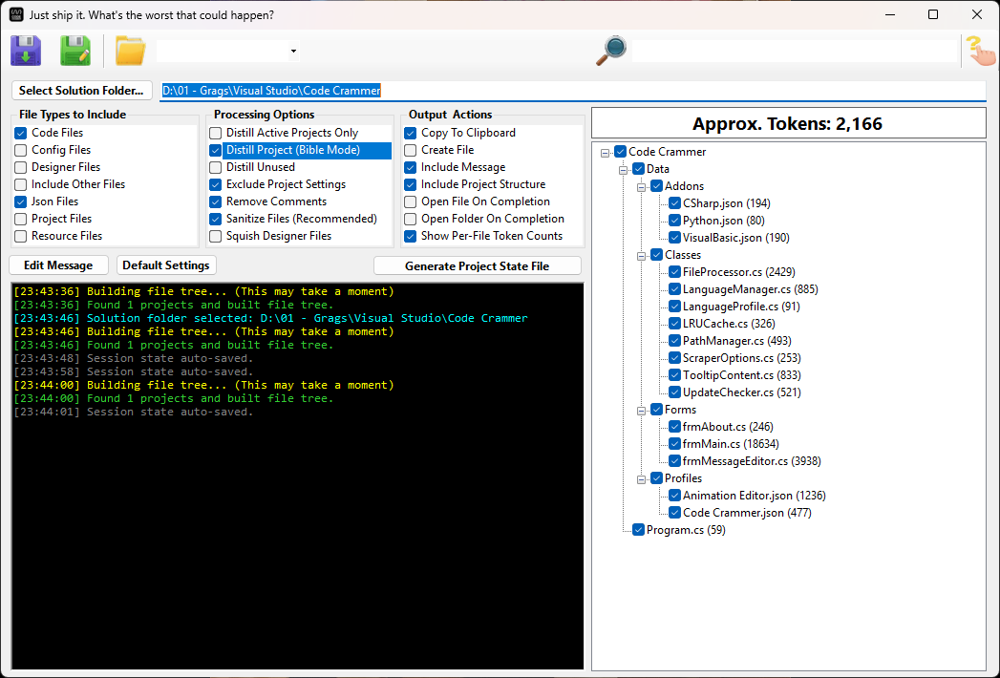

Code Crammer

Stop hitting the token limit.

Code Crammer is a developer utility that takes your entire Visual Studio solution (.sln) and compresses it into a single, optimized text file ready for any LLM

It doesn't just copy-paste files. It "crams" them—removing comments, whitespace, and binary junk, while intelligently squishing massive Designer files so the AI understands your UI without wasting 5,000 tokens on auto-generated code.

Code Crammer solves this by flattening your project structure into a format LLMs can digest in one gulp.

🛠 Features that actually matter

Designer Squishing: Turns 2,000 lines of `Form1.Designer.cs` into a 10-line summary. The AI knows you have a button named `btnSave`, but doesn't need to see the 50 lines of code setting its padding.
Bible Mode (Distill Project): Creates a "Map" of your project containing only class names, method signatures, and properties. Great for asking architectural questions without sharing implementation details.
Token Estimator: See exactly how much "cost" your project has before you paste it.
Sanitization: Automatically strips sensitive data from `.resx` files and removes useless comments.

🚀 How to use

1. Select your solution folder. Code Crammer automatically scans for `.csproj` and `.vbproj` files.
2. Check the files you want. Use the tree view to include/exclude specific folders.
3. Choose your cramming level:
 Standard: Full code, no comments.
 Squish Designer: Compress UI code (Recommended).
 Distill: Signatures only (Max compression).
4. Click Generate.
5. Paste. The output is automatically copied to your clipboard or saved to your Downloads.

📦 Download

[Download the latest version here](https://github.com/Gragsy/Code-Crammer/releases/latest)

No installation required. Just unzip and run.

⚙️ Requirements

Windows 10 or 11
.NET 10 Runtime (The app will prompt you to download it if missing)

⚖️ License

MIT License. Do whatever you want with it.